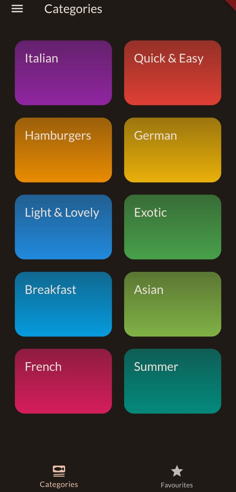

# Cooking Up Meals App

Welcome to the Meals App! This app is your ultimate companion for discovering a wide variety of delicious meals along with their recipes. Whether you're a novice in the kitchen or a seasoned chef, this app has something for everyone. Explore recipes, find your favorites, and make cooking an enjoyable experience.  

## Getting Started
### Prerequisites
Before you begin, ensure you have the following:

Flutter SDK installed on your machine. If not, you can download and install it from the official Flutter website.
An Android or iOS device or emulator to run the app.

## Installation
### 1.Clone the Repository
Start by cloning this repository to your local machine using Git:
git clone https://github.com/believer-99/cooking_up_meals_app.git

### 2.Navigate to the Project Directory
 Change your current directory to the newly cloned repository:  
 cd cooking_up_meals_app

 ### 3.Install Dependencies
 Use Flutter's package manager, flutter pub, to install the app's dependencies:  
 flutter pub get

## Features

### 1.Meal Collection
The app boasts an extensive collection of meals that cater to various tastes and preferences. From breakfast to dinner and everything in between, you'll find a diverse range of meals to suit any occasion.

### 2.Recipes
Each meal comes with a detailed recipe that provides step-by-step instructions on how to prepare it. Simply click on a meal to access its recipe and start cooking right away.  

### 3. Additional Info about the Meal
a. Cooking Time
We understand that time is of the essence. To help you plan your meals effectively, each recipe includes an estimated cooking time. This way, you can choose meals that fit your schedule.

b. Difficulty Level
Whether you're a culinary expert or a beginner, you'll appreciate the difficulty level indicators provided for each meal. This helps you select recipes that match your skill level and comfort in the kitchen.

c. Cost Relevance
Budget-conscious? No problem! Our app rates each meal's cost relevance, allowing you to make choices that align with your budgetary preferences.

### 4.Favourites Page
Have a meal you absolutely love? You can mark it as a favorite and access it later from the dedicated Favorites page. Never lose track of your most cherished recipes again.  

### 5.Meal Filters
We understand that everyone has their own preferences. The app allows you to apply filters to the meal categories, ensuring that you only see the meals that match your desired criteria. This way, you can streamline your search and find the perfect recipe quickly.

## Using The App
### 1.Navigation
he app has a bottom navigation bar to switch between different sections, the meal categories and favorites.

### 2.View Recipe
 Click on a meal card of a particular category to access the detailed recipe page. Here, you can find cooking instructions, ingredients, cooking time, difficulty level, and cost relevance.

 ### 3.Favourites
 To mark a meal as a favourite, tap on the star icon the meal's recipe page. You can later view it on the favourites' page as well.

 ### 4.Apply Filters
 In the filters section, you can customize your browsing experience by selecting specific categories or preferences.  
 
